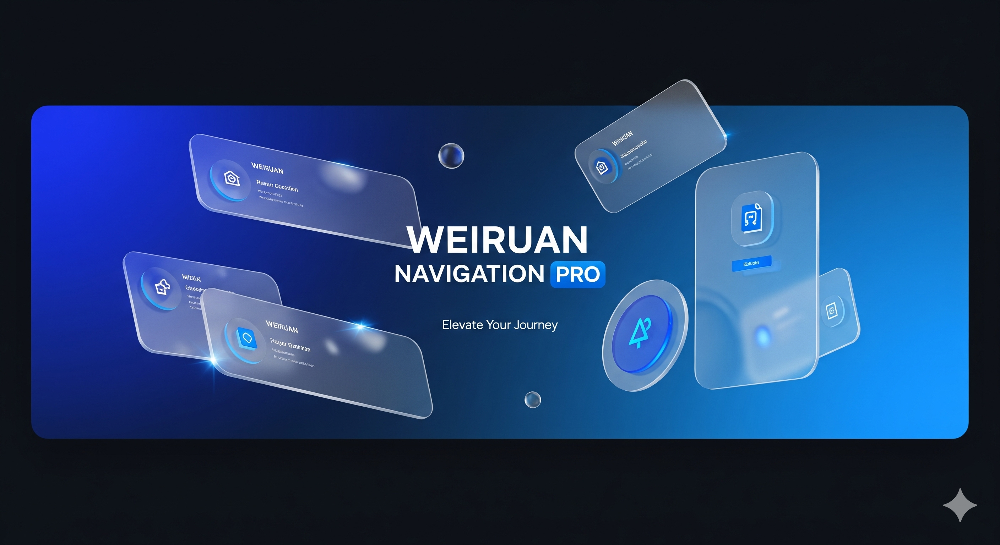

<!-- 宣传大图代码 -->
<!-- 请确保项目根目录下有 banner.png 文件 -->

 
 

<!-- Logo -->

<h1 align="center">威软导航 PRO</h1>

<strong>连接数字未来 · 极简、纯净、高效的网址导航解决方案</strong>

 

📖 项目简介 (Introduction)

威软导航 (Weiruan Navigation) 是一款基于 Python Flask 和 SQLite 构建的现代化轻量级导航系统。它摒弃了传统导航站繁杂的布局，采用极简主义设计语言，结合 Glassmorphism (毛玻璃) 视觉风格，为用户提供沉浸式的浏览体验。

本项目专为追求效率与美学的开发者、设计师及极客打造。内置强大的后台管理系统，支持一键收录、智能图标抓取、SEO 自动化配置及精细化链接运营。

首页预览：深色模式下的毛玻璃卡片设计

✨ 核心特性 (Features)

🎨 极致的 UI/UX 设计

沉浸式深色模式：专为夜间浏览优化，护眼且极具科技感。

毛玻璃特效：采用现代前端技术栈，呈现通透的视觉层次。

全端响应式：完美适配 Desktop、Tablet 及 Mobile 设备。

⚡️ 智能化后台管理

智能图标引擎：输入 URL 自动抓取目标网站 Favicon，支持超时自动回退机制。

可视化运营：支持链接置顶、加精推荐、拖拽排序（通过权重控制）。

SEO 友好：后台动态配置网站 Title、Keywords、Description，无需修改代码。

🛡 安全与性能

轻量级架构：基于 Flask + SQLAlchemy，单文件数据库，迁移备份零成本。

安全防护：内置管理后台登录验证，Session 加密，防止暴力破解。

跳转安全页：外链跳转中间页提示，提升安全性并统计点击数据。

🛠 技术栈 (Tech Stack)

Backend: Python 3, Flask, SQLAlchemy

Frontend: HTML5, Tailwind CSS (CDN), Alpine.js

Database: SQLite (无需安装 MySQL，开箱即用)

Icon Service: Iowen API / Google API (自动回退)

🚀 快速开始 (Quick Start)

1. 克隆项目

git clone [https://github.com/yourusername/weiruan-nav.git](https://github.com/yourusername/weiruan-nav.git)
cd weiruan-nav

2. 安装依赖

建议使用虚拟环境运行：

# 创建虚拟环境 (可选)
python -m venv venv
source venv/bin/activate  # Windows: venv\Scripts\activate

# 安装依赖
pip install -r requirements.txt

3. 运行项目

# 开发环境运行
python app.py

# 生产环境运行 (使用 Gunicorn)
gunicorn -w 4 -b 0.0.0.0:5000 app:app

访问 http://localhost:5000 即可看到首页。
后台管理入口：http://localhost:5000/admin (默认账号：admin / password)

📂 目录结构 (Structure)

weiruan-nav/
├── app.py               # 核心业务逻辑与路由
├── nav.db               # SQLite 数据库 (自动生成)
├── requirements.txt     # 项目依赖列表
├── banner.png           # 项目宣传图 (请自行上传)
├── templates/           # 前端模板文件
│   ├── index.html       # 首页 (前台)
│   ├── admin.html       # 管理后台 (核心)
│   ├── login.html       # 登录页
│   └── jump.html        # 跳转中转页
└── README.md            # 项目说明文档

⚙️ 部署建议 (Deployment)

本项目非常适合部署在以下环境：

宝塔面板 (推荐)：使用 Python 项目管理器一键部署。

Docker: 容器化部署。

Render / Vercel: 适合演示或个人轻量使用 (注意 SQLite 数据持久化问题)。

📝 版权说明 (License)

本项目采用 MIT License 开源协议。
Designed & Developed by 威软科技开发.

如果觉得本项目对您有帮助，请给个 ⭐️ Star 吧！

